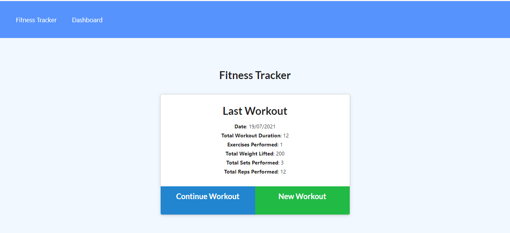
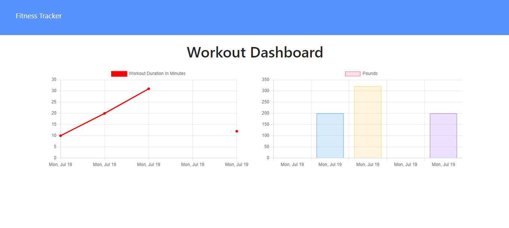

[MIT License](https://choosealicense.com/licenses/mit/)

# Workout Tracker

## Table of Contents
1. [Description](#description)
2. [Technology](#technology)
3. [Screenshots](#screenshots)

  
## Description <a name="description"><a/>

This application tracks a users workouts. The stats for the last workout are shown on the home page. The user can see their workout duration and weight on the dashboard page, where they are displayed as charts.

## Technology <a name="technology"><a/>

-MongoDB
-Express
-JS
-Node.js
-Morgan
-dotenv
-Mongoose

## Screenshots

